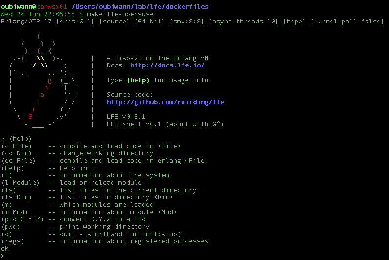

# dockerfiles

*Dockerfiles for LFE on various distributions*

<image src="resources/images/docker-thumb.png" />

##### Table of Contents

* [About](#about-)
* [Distributions](#distributions-)
* [Bonus](#bonus-)
* [Usage](#usage-)
  * [Native Docker](#native-docker)
  * [From Source](#from-source)

## About [&#x219F;](#table-of-contents)

This repository provides a handful of LFE ``Dockerfile``s for various Linux
distributions, thus allowing a developer instant access to an environment
where they can run LFE or do LFE development.


## Distributions [&#x219F;](#table-of-contents)

This repo provides ``Dockerfile``s for the following Linux distributions:

* Arch Linux
* CentOS (a rather tortured -- but working -- Erlang install to ensure
  leex is present... help?)
* Debian
* openSUSE
* Oracle Linux
* Slackware (currently broken... help!)
* Ubuntu

If you don't see your favourite, we accept pull requests!

Ordered by size (smallest to largest using the output from ``docker images``),
we have the following:

```
lfex/ubuntu        latest        9d9b69912d29        10 minutes ago      450.7 MB
lfex/debian        latest        c9e8478d9602        11 minutes ago      518.7 MB
lfex/centos        latest        24df528bee21        8 minutes ago       905.9 MB
lfex/opensuse      latest        a0d509ffcdad        12 minutes ago      1.132 GB
lfex/oracle        latest        69c066425570        7 minutes ago       1.315 GB
lfex/arch          latest        7711e7f7ab84        9 minutes ago       1.571 GB
```

## Bonus [&#x219F;](#table-of-contents)

Each image comes with a bonus: a special color LFE REPL banner :-)

(Free! One in every box, kids!)




## Usage [&#x219F;](#table-of-contents)

### Native Docker

Example usage is given below using the ``lfex/opensuse`` image. For other
distributions, simply substitute the name in all the ``make`` targets.

Pull an image from [Docker Hub](https://registry.hub.docker.com/repos/lfex/):

```bash
$ docker pull lfex/opensuse
```

Start the REPL:

```
$ docker run -i -t lfex/opensuse lfe
```

### From Source

Example usage is given below using the ``lfex/opensuse`` image. For other
distributions, simply substitute the name in all the ``make`` targets.

Build an image:

```bash
$ make opensuse
```

Ensure an image is working as expected:

```bash
$ make check-opensuse
The answer is: 42
```

Start up a container and log in directly to an LFE REPL:

```
$ make lfe-opensuse
Erlang/OTP 17 [erts-6.1] [source] [64-bit] [smp:8:8] [async-threads:10] ...

         (
     (    )  )
      )_.(._(
   .-(   \\  )-.       |   A Lisp-2+ on the Erlang VM
  (     / \\    )      |   Docs: http://docs.lfe.io/
  |`-.._____..-';.     |
  |         g  (_ \    |   Type (help) for usage info.
  |        n    || |   |
  |       a     '/ ;   |   Source code:
  (      l      / /    |   http://github.com/rvirding/lfe
   \    r      ( /     |
    \  E      ,y'      |   LFE v0.9.1
     `-.___.-'         |   LFE Shell V6.1 (abort with G^)

>
```


Start up a container and log in directly to a Bash shell:

```bash
$ make bash-opensuse
0c66429e657e:/ #
```

